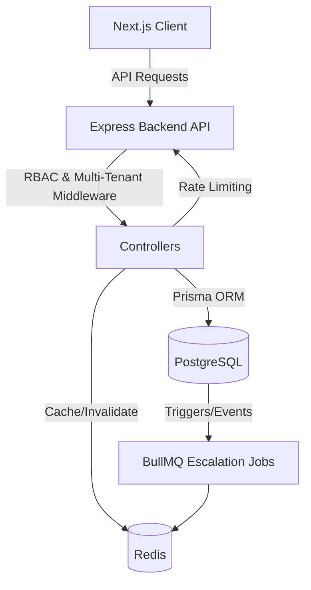

# Airman Technical Assessment

A full-stack monorepo application implementing the **"Maverick-lite" (Learning)**, **"Skynet-lite" (Scheduling)**, and **Multi-Tenant Ops** modules for a modern aviation academy. It fulfills ALL **Level 1 and Level 2** assessment requirements, including Multi-Tenancy (Row-Level Isolation), strict Role-Based Access Control (RBAC), Audit Logs, Background Workflow Jobs, Performance Optimization (Redis Caching, Rate Limiting, Indexing), and full CI/CD deployment configurations.

## 🏗️ Architecture Diagram


## 🚀 Setup Steps

### 1. Docker Compose (Quickest)
Spins up the PostgreSQL database, Redis, the Express Backend API, and the Next.js Frontend.
```bash
docker-compose up --build
```
- **Frontend**: `http://localhost:3000`
- **Backend API**: `http://localhost:4000`

### 2. Local Development setup
1. Run local Postgres & Redis.
2. Setup environment variables (`.env` in `apps/api` and `apps/web`).
3. Under `apps/api`:
   ```bash
   npm i
   npx prisma db push
   npx ts-node prisma/seed.ts # Seed DB
   npm run dev
   ```
4. Under `apps/web`:
   ```bash
   npm i
   npm run dev
   ```

## 🔑 Demo Credentials (Seeded)
Tenant: `Top Gun Academy` (ID: `top-gun-tenant-id`)
- **Admin**: `ADMIN` / `admin123`
- **Instructor**: `MAVERICK` / `admin123`
- **Student**: `ROOSTER` / `admin123`

## 🧠 Key Technical Decisions & Tradeoffs
1. **Monorepo Architecture (NPM Workspaces)**: Centralizes configuration and enables shared types natively. Tradeoff: Slightly steeper learning curve for CI/CD folder scoping without a heavier tool like Turborepo.
2. **Next.js App Router**: Optimized for server components and layout routing.
3. **Prisma ORM & PostgreSQL**: Shared DB with `tenant_id` on every row. Tradeoff: Requires strict middleware/query scoping to prevent cross-tenant leakage, rather than physically separate schemas (which are harder to migrate).
4. **Redis & BullMQ**: Used for caching, rate limiting stores, and asynchronous delay queues for Admin Escalations. Tradeoff: Introduces another infrastructural dependency but strictly required for Level 2 performance/workflows.

## 📖 API Documentation & Sample Requests

The API follows REST conventions prefixed at `/api/v1`.

### Endpoints overview
- `POST /auth/login`, `POST /auth/register`
- `GET/POST/PATCH/DELETE /learning/courses`, `/learning/courses/:id/modules`, `/learning/courses/:cId/modules/:mId/lessons`
- `GET/POST/PATCH/DELETE /bookings`
- `GET /tenants`

### Sample Request (Create Booking)
```bash
curl -X POST http://localhost:4000/api/v1/bookings \
  -H "Authorization: Bearer <JWT_TOKEN>" \
  -H "Content-Type: application/json" \
  -d '{
    "courseId": "clkjh123",
    "startTime": "2026-03-01T10:00:00Z",
    "endTime": "2026-03-01T12:00:00Z"
  }'
```

### Sample Request (Get Courses - Cached)
```bash
curl -X GET http://localhost:4000/api/v1/learning/courses \
  -H "Authorization: Bearer <JWT_TOKEN>"
```
